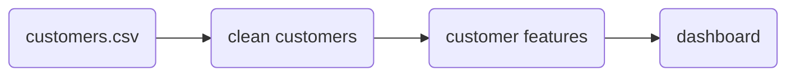
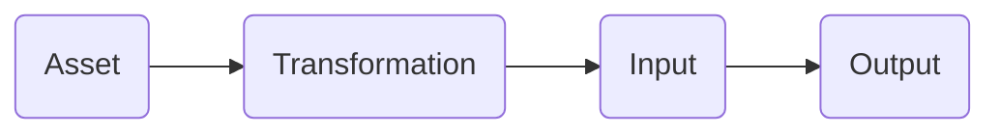
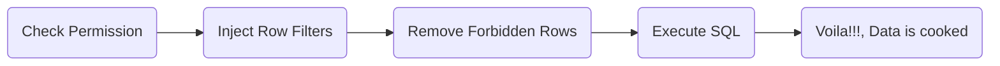

# Project Data Nice

This is the journey for grasping the fundamentals of hows and whys of systems.

## Requirements

- Data Lineage
- Data Validation
- Permissions (Role Based)

## Modules

- [Authentication](#authentication)
  - Users
  - Groups
  - Roles
  - API Keys
  - Tokens
- [Authorization](#authorization)
- [Catalog](#catalog)
- [Validation Engine](#validation-engine)
- [Storage](#storage)
  - Files
  - Database Records
  - (Even) Object Storages
- [Lineage](#lineage)
- [Query Engine](#query-engine)

## Authentication

- [ ] TODO

## Authorization

- [ ] TODO

## Catalog

- [ ] TODO
 
## Validation Engine

- [ ] TODO

# Storage

- [ ] TODO

# Lineage

- [ ] TODO

Think of this layer as a (potentially) complex graphing system. for example:

But if we want to look as a system feature, we can look at it like

# Query Engine

This is one of my favorite modules, where it's not just about executing 
queries, for our case it's matter of chain of responsibility like

